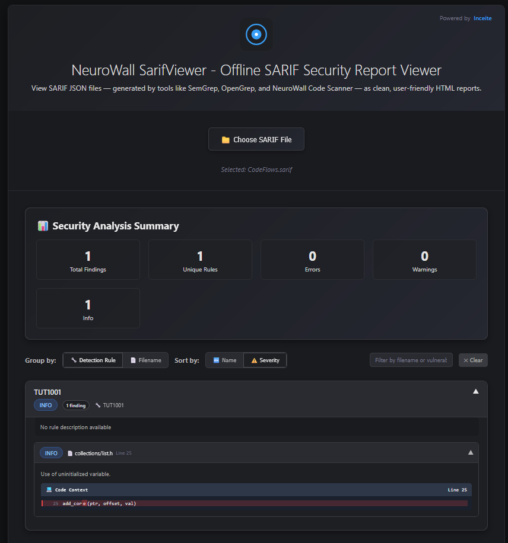

# NeuroWall SarifViewer - Offline SARIF Security Report Viewer

**NeuroWall SarifViewer** is an offline, interactive **SARIF (Static Analysis Results Interchange Format) viewer**. It converts raw `.sarif` or `.json` security scan results (from tools like **SemGrep, OpenGrep, and NeuroWall Code Scanner**) into clean, user-friendly HTML reports that can be viewed locally in your browser.

---

## 🚀 Features

* **Offline Support** – Works entirely client-side. No server required.
* **Upload & View** – Load `.sarif` or `.json` security reports directly into the viewer.
* **Security Summary Dashboard** – Visual stats for:

  * ✅ Total findings
  * 🔧 Unique rules triggered
  * ⚠️ Errors, ⚠️ Warnings, ℹ️ Info counts
* **Smart Grouping & Sorting** – Organize results by:

  * Rule ID / Detection Rule
  * Source Filename
  * Sort findings by **Severity** or **Name**
* **Filtering** – Quickly search by filename, vulnerability name, or rule ID.
* **Interactive Findings** – Expand/collapse sections for rules, files, and individual findings.
* **Code Context** – Inline vulnerable code snippets with highlighted lines and columns.
* **Responsive Design** – Works smoothly on desktop and mobile.

---

## 📂 Usage

1. Download or clone this repository.
2. Open `NeuroWall_SarifViewer.html` in your browser (no setup required).
3. Click **📁 Choose SARIF File** and select your `.sarif` or `.json` report.
4. Explore results with grouping, sorting, and filtering controls.

---

## 🛠 Example Use Cases

* Reviewing static analysis results offline.
* Sharing scan results in a readable format with non-technical teams.
* Comparing findings across multiple tools (SemGrep, OpenGrep, NeuroWall).
* Quick triage of vulnerabilities without needing heavy IDE or CI/CD integration.

---

## 📷 Screenshots

---

## ⚡ Technology

* **Pure HTML, CSS, and JavaScript**
* No external dependencies, no server required.
* Works fully offline in any modern browser.

---

## 📜 License

This project is developed by **[Inceite](https://inceite.com)**.
Use freely for security report viewing and sharing.
